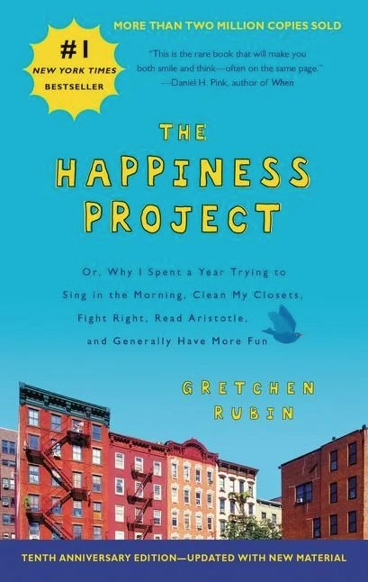

## Core Idea

:::{.columns}
::: {.column width="55%"}

*The Happiness Project* is Gretchen Rubin’s year-long experiment to see whether she can become noticeably happier without changing the basic structure of her life. She is not in crisis; she has a good marriage, healthy children, interesting work. Yet she feels she is “wasting her life” in busyness and not fully appreciating it.

She designs a one-year project with **twelve monthly themes** (vitality, marriage, work, parenthood, leisure, friendship, money, eternity, passion, mindfulness, attitude, and “boot camp perfect”). Each month she adds concrete resolutions, tracks them daily, and reports honestly on what works and what doesn’t.

The core claim: happiness rarely comes from dramatic external change. It comes from **small, repeated, value-aligned actions** in the life you already have.

> You can change your life without moving to a monastery or quitting your job; you start by paying attention to how you live your days.

:::

::: {.column width="45%"}
{width="75%" fig-align="center"}
:::
:::

---

## Personal Frank View

This is a **very readable**, very practical book. Rubin is good at turning research and philosophy into concrete experiments and simple sentences. The monthly structure makes it easy to copy her method and run your own “happiness project”.

At the same time, the book is **narrow**: it is written from the perspective of a privileged, upper-middle-class New York life with relatively few structural constraints. The problems are real but not extreme. Some readers will find the tone a bit self-absorbed.

I see it as a **toolkit book**. You don’t need to buy the whole worldview. You can take the useful pieces: the idea of themes per month, the resolution chart, and the focus on tiny, specific behaviours instead of vague “be happier” goals.

---

## Chapters Summary

### January – Boost Energy (Vitality)  
> “More energy makes it easier to do all the things that make me happy.”

Rubin starts with **physical and mental energy**, because everything else depends on it. Her resolutions: sleep earlier, exercise better, declutter (“toss, restore, organize”), tackle nagging tasks, and “act more energetic”. She discovers that order in her environment (clearing closets, fixing small annoyances) frees mental bandwidth. Sleep and movement are framed as **foundations of happiness**, not luxuries. :contentReference[oaicite:0]{index=0}  

---

### February – Remember Love (Marriage)  
> “I can’t change my husband, but I can change how I show up.”

The focus shifts to **marriage**. Resolutions include: quit nagging, don’t expect praise or appreciation, “fight right”, no dumping of petty complaints, and give proofs of love in his language. She experiments with a “week of extreme niceness”. The key idea: small, daily interactions (tone of voice, tiny criticisms, little acts of thoughtfulness) compound more than grand romantic gestures. :contentReference[oaicite:1]{index=1}  

---

### March – Aim Higher (Work)  
> “Happy people work more and better with others.”

March is about **work and ambition**. Rubin already likes her work as a writer, but she wants more engagement and risk. She launches a blog, sets clearer goals, asks for help, and tries to “enjoy the fun of failure”. The message: challenge and novelty create satisfaction; small daily progress on meaningful work beats vague big goals. Work is recast as a major source of happiness, not just income. :contentReference[oaicite:2]{index=2}  

---

### April – Lighten Up (Parenthood)  
> “I want a joyful home, not just a well-managed one.”

Here she focuses on **parenting**. Resolutions: sing in the morning, acknowledge the reality of children’s feelings, be a “treasure house of happy memories”, and take time for small family projects. Instead of just managing logistics, she tries to be more playful and less irritable. The chapter argues that **lightness and humour** with children are not trivial; they are central to both their happiness and yours. :contentReference[oaicite:3]{index=3}  

---

### May – Be Serious About Play (Leisure)  
> “What’s fun for other people may not be fun for me.”

May is about **play and hobbies**. Rubin realises she often does “pretend fun” that she thinks she *should* enjoy. Her resolutions: find real fun, take time to be silly, start collections, and remember that fun often requires **effort and planning**. She introduces the idea of “Be Gretchen”: accept what you actually like, not what is impressive or socially approved. Leisure becomes a serious input into happiness, not a leftover. :contentReference[oaicite:4]{index=4}  

---

### June – Make Time for Friends (Friendship)  
> “One of the best ways to make yourself happy is to make other people happy.”

June is dedicated to **friendship and social ties**. Resolutions: remember birthdays, show up, don’t keep score, cut people slack, and make new friends. She emphasises that relationships need **deliberate maintenance**: invitations, replies, small favours. Happiness is framed as deeply social; investing in friends is presented as one of the most reliable happiness strategies. :contentReference[oaicite:5]{index=5}  

---

### July – Buy Some Happiness (Money)  
> “Money doesn’t automatically bring happiness, but it can be used to buy it.”

Rubin looks at **money and spending**. Instead of “money doesn’t matter” or “money is everything”, she takes a middle view: money can increase happiness when spent on things that support values — experiences, time, comfort, and easing daily friction. Resolutions include: splurge on what matters, save where it doesn’t, buy needful things without guilt, and give more. The core: align spending with **true sources of joy**, not status. :contentReference[oaicite:6]{index=6}  

---

### August – Contemplate the Heavens (Eternity)  
> “Regular life feels different when you remember it is finite.”

August turns to **spirituality, gratitude, and perspective**. Rubin reflects on mortality, religion, and big questions, in her own secular-leaning way. Resolutions: read spiritual texts, keep a gratitude practice, imitate a spiritual master she admires, and keep a “one-sentence journal”. The idea is that thinking about eternity and meaning helps her experience ordinary days more deeply, not less. :contentReference[oaicite:7]{index=7}  

---

### September – Pursue a Passion (Books)  
> “My love of books isn’t trivial; it’s central.”

September is about **passion and personal projects**, and for Rubin that means books and reading. She gives herself permission to take her loves seriously: reading, writing, talking about ideas. Resolutions: write a novel-like children’s book, create more time for reading, start a book group, and follow enthusiasms. This chapter argues that indulging a passion is not selfish; it is a strong, direct route to happiness. :contentReference[oaicite:8]{index=8}  

---

### October – Pay Attention (Mindfulness)  
> “The days are long, but the years are short.”

Here she works on **mindfulness and presence**. Resolutions: meditate (in a very light, Rubin way), practise mindful walking, pause before reacting, and truly notice small pleasures. She wants to stop living on autopilot and to reduce emotional reactivity. The goal is less about spiritual enlightenment and more about **actually being present** in the life she already has. :contentReference[oaicite:9]{index=9}  

---

### November – Keep a Contented Heart (Attitude)  
> “It’s easy to be heavy; hard to be light.”

November focuses on **attitude and emotional tone**. Resolutions: laugh more, take things less personally, avoid gossip and envy, and reinterpret events generously. She explores how much of happiness is a **lens**, not a situation: choosing humour over irritation, curiosity over offence. The challenge is to stay warm and appreciative even when things are imperfect. :contentReference[oaicite:10]{index=10}  

---

### December – Boot Camp Perfect (Happiness)  
> “No one can be ‘perfect’ at happiness — but effort matters.”

In December she tries to follow **all her resolutions at once**. Unsurprisingly, she fails at “perfection”, which becomes the final lesson: the point of a happiness project is not to become a flawlessly happy person, but to **move the baseline**. She reflects on what actually changed: more gratitude, fewer pointless quarrels, more order, more play. The project ends with a modest conclusion: small, deliberate actions, repeated over time, made her life meaningfully happier. :contentReference[oaicite:11]{index=11}  

---
