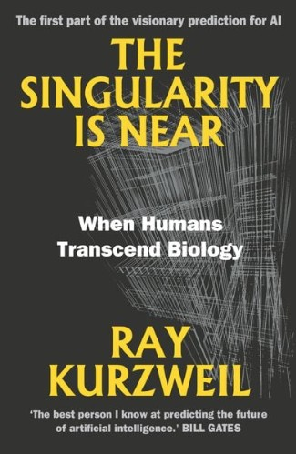

## Core Idea

:::{.columns}
::: {.column width="55%"}

*The Singularity Is Nearer* revisits and updates Ray Kurzweil’s original thesis from *The Singularity Is Near* (2005). He argues that technology follows a **law of accelerating returns**: progress compounds exponentially, not linearly, especially in computing, AI, biology, and nanotech.  

Kurzweil claims we are on track to reach **AGI around 2029** and a full “Singularity” by the **mid-2040s**, when human and machine intelligence will merge through brain–computer interfaces, nanobots, and bio-digital integration.  
This merger, in his view, will massively expand human intelligence, extend healthy lifespans, and transform society — a shift as deep as any in biological evolution.

> We are not just building smarter machines; we are preparing to **merge with our machines** and redefine what it means to be human.  

:::

::: {.column width="45%"}
{width="75%" fig-align="center"}
:::
:::

---

## Personal Frank View

This book is **visionary, optimistic, and very “Kurzweil”**: confident timelines, sweeping evolutionary arcs, and an almost religious trust in progress. The strongest parts are where he connects **six stages of evolution**, current AI breakthroughs, and long-run implications for health, longevity, and cognition in a coherent story. :contentReference[oaicite:3]{index=3}  

But it is also **one-sided**. Risks are acknowledged, yet the weight of the book leans towards a techno-utopian outcome. The timelines (AGI by 2029, million-fold enhancement by 2045) are argued, but not rigorously defended against sceptical scenarios. :contentReference[oaicite:4]{index=4}  

I’d treat it less as a forecast and more as a **provocative scenario**: a structured, optimistic hypothesis about the next 20–30 years of AI and biotech. Very useful to sharpen your own views — dangerous only if you take the dates and inevitability at face value.

---

## Chapters Summary

### Introduction  
> “The future is already arriving — just unevenly understood.”

The introduction sets the stage: Kurzweil revisits his 2005 predictions and argues that many have roughly tracked reality (speech recognition, mobile computing, AI capabilities), so his broader **exponential thesis still holds**. :contentReference[oaicite:5]{index=5}  
He frames this new book as an update: we are much closer to the Singularity now, and the rise of deep learning and large language models is presented as strong evidence that machine intelligence is progressing along his expected curve.

---

### Chapter 1: Where Are We in the Six Stages?  
> “We are living at the hinge between biological and non-biological intelligence.”

Kurzweil describes **six epochs / stages of evolution**:  
1. Physics & chemistry  
2. Biology & DNA  
3. Brains  
4. Technology  
5. The merger of human and machine intelligence  
6. The universe “waking up”  

He maps current progress onto stage 4 transitioning into 5: AI now rivals or surpasses humans in narrow tasks, and we are beginning to interweave computation with biology (wearables, implants, brain research). :contentReference[oaicite:6]{index=6}  
This chapter is a conceptual map: where we came from, where we stand, and why he thinks the next jump will be qualitatively different.

---

### Chapter 2: Reinventing Intelligence  
> “Intelligence is not fixed; it is an information process that can be replicated and amplified.”

Here he focuses on **AI itself**: deep learning, large language models, reinforcement learning, and hybrid systems. The core claim: intelligence is an **algorithmic, physical process**, not a mystical property of biology. Once we understand and scale that process, machines can reach **AGI** — which he still places around **2029**. :contentReference[oaicite:7]{index=7}  

He contrasts symbolic AI and modern neural approaches, arguing that combining statistical learning with structured reasoning and richer architectures will drive the step from “narrow” to “general”. This chapter is less technical than a research paper but aims to convince a non-technical reader that AGI is a matter of **engineering and compute**, not magic.

---

### Chapter 3: Who Am I  
> “You are not your cells; you are the pattern they instantiate.”

Kurzweil tackles **identity and consciousness**. He argues that what we call the “self” is a **pattern of information and processes** in the brain. Cells, molecules, and atoms are constantly replaced, but the pattern persists.  

From this, he infers that if we can **replicate or extend this pattern** in non-biological substrates (e.g. uploads, digital twins, brain-linked AI), personal identity can continue beyond the biological brain. This does not “kill” humanity; it redefines being human as a **continuously evolving information process**, not a fixed biological object.

---

### Chapter 4: Life Is Getting Exponentially Better  
> “The data of human history shows progress, even when our intuitions don’t.”

This chapter is the defence of **techno-optimism**. Kurzweil marshals data on poverty rates, life expectancy, child mortality, disease burden, education, and access to information to argue that, over the long run, **living conditions have improved dramatically** — and largely due to science and technology. :contentReference[oaicite:8]{index=8}  

He acknowledges crises, inequality, and conflict, but insists these exist against a backdrop of strong positive trends. The point is to show that extrapolating exponential innovation is not naive wishful thinking but an extension of historical patterns — if we manage risks.

---

### Chapter 5: The Future of Jobs – Good or Bad?  
> “We’ve automated work for centuries — and created new work in the process.”

Kurzweil discusses **automation and employment**. He expects AI to replace a large fraction of current tasks but believes it will also create new categories of work, many of which we can’t yet specify. He leans toward a **“good, but disruptive”** outcome: more productivity, new creative and interpersonal roles, but significant transitional pain. :contentReference[oaicite:9]{index=9}  

He is sympathetic to policies like **universal basic income** or similar safety nets to smooth the transition, and sees human–AI teams (rather than humans versus AI) as the central unit of future productivity.

---

### Chapter 6: The Next Thirty Years in Health and Well-Being  
> “We are moving from reactive medicine to information-driven, proactive repair of the body.”

This chapter applies the exponential lens to **biotech and longevity**. Kurzweil argues that genetics, proteomics, nanotechnology, and AI-assisted drug design will allow us to:  

- Detect diseases earlier and more precisely  
- Personalise treatments  
- Use **nanobots** or targeted interventions to repair damage at cellular levels  

He re-states the goal of reaching **“longevity escape velocity”** — where medical progress extends life faster than aging takes it away — within the next few decades. :contentReference[oaicite:10]{index=10}  
The result: radically longer healthy lifespans, with psychological and social consequences we are not yet prepared for.

---

### Chapter 7: Peril  
> “Every powerful technology is dual-use.”

Here Kurzweil turns to **risks**: misuse of AI for cyberwarfare, surveillance, autonomous weapons, mass manipulation, and catastrophic accidents. He considers both **uncontrolled AI** and **human bad actors with AI** as serious concerns. :contentReference[oaicite:11]{index=11}  

His stance is still more optimistic than many AI safety critics: he believes that **aligned, beneficial AI** is achievable and that the same exponential forces that create risk can help build defences. But this chapter at least acknowledges that the road to the Singularity is not automatically safe or benevolent.

---

### Chapter 8: Dialogue with Cassandra  
> “Cassandra sees the dangers; I see the possibilities.”

The book closes with a **dialogue format** between Kurzweil and a fictionalised sceptic (“Cassandra”). Cassandra raises the obvious objections: timelines are too optimistic, exponential trends saturate, complexity and politics derail progress, AI may not be controllable, and humans are not purely rational.  

Kurzweil answers by re-arguing his main points: the historical track record of exponential technologies, ongoing evidence of rapid AI improvement, and his belief that **human ingenuity plus AI** can handle emerging problems. The dialogue structure forces him to surface criticisms explicitly, but the conclusion remains firmly optimistic: the Singularity is not just nearer — it is **inevitable and desirable**, if we navigate the peril with care.

---
