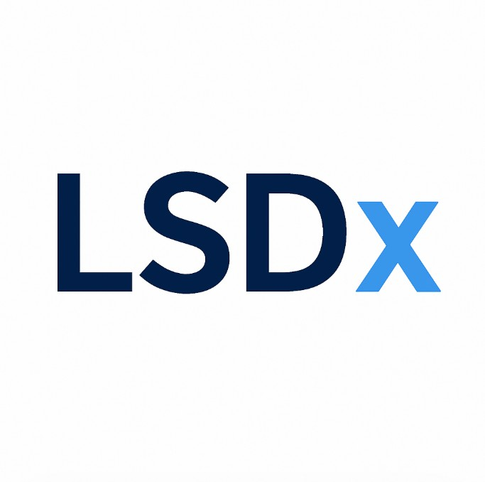

:::{.columns}
::: {.column width="55%"}

I’ve added [**LSDx**](https://www.lsdsx.xyz/) to the new [**Founder & Entrepreneurial Initiatives**](../founder.html) page on my website.

LSDx is a research-driven initiative focused on analytical infrastructure for liquid staking derivatives. The project is built around pricing logic, liquidity interpretation, collateral quality, and market structure in decentralised finance.

The main website is available [here](https://www.lsdsx.xyz/), and the technical documentation can be found [here](https://www.lsdsx.xyz/docs).

:::

::: {.column width="45%"}
{width="75%" fig-align="center"}
:::
:::

